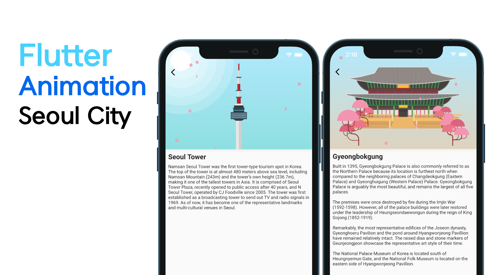

# Flutter Seoul City Animation
While studying Flutter's animation, I expressed the famous architecture of Seoul in Korea.

 

## Youtube
[Flutter Seoul City Animation - Speed Code](https://youtu.be/WuBLDse81DE)

 

    
## Reference
* https://codepen.io/team/codepen/pen/abvdJjN

## Images
* Gyeongbokgung Palace Vectors by Vecteezy
- https://www.vecteezy.com/free-vector/gyeongbokgung-palace

* Seoul Vectors by Vecteezy
- https://www.vecteezy.com/free-vector/seoul

## Keyword
AlwaysStoppedAnimation, Tween, Animation , ColorTween, CurvedAnimation, FadeTransition, Hero,
flightShuttleBuilder, Gyeongbokgung, Seoul Tower
